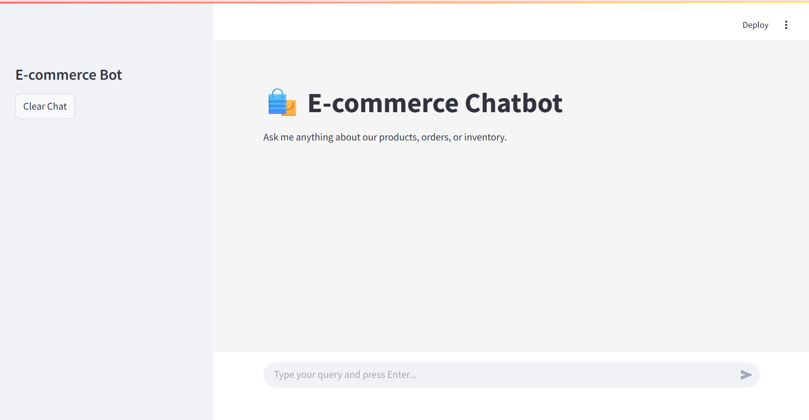
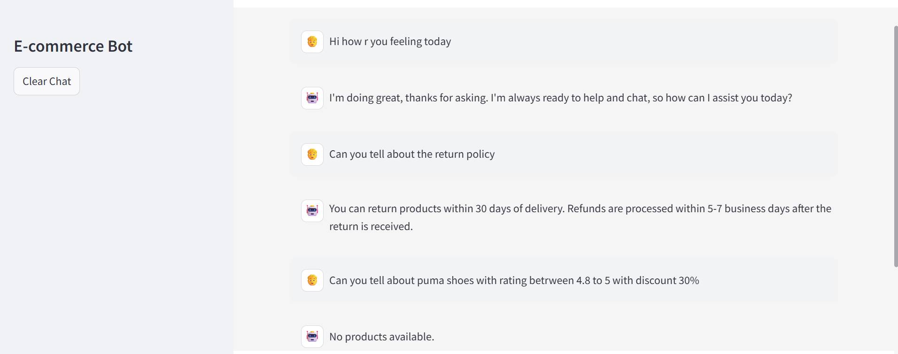
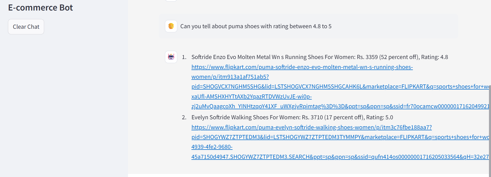

# 🛍️ E‑commerce GenAI Toolkit

An end‑to‑end **Streamlit** chatbot that combines semantic routing, vector search and Groq LLMs to answer product questions, analyse your catalogue, and handle small‑talk for an online store.

## ✨ Features

* **Multi‑skill conversational agent** with three specialised chains:

  * **FAQ** – vector search over `faq_data.csv` with ChromaDB + generative answer.
  * **SQL** – LLM‑generated SQLite queries on `db.sqlite` and natural‑language summarisation of results.
  * **Small‑talk** – friendly chitchat powered by Groq.
* **Semantic intent routing** via *semantic‑router* & Sentence‑Transformers.
* **Streamlit UI** with chat avatars, instant clearing and mobile‑friendly layout.
* **Plug‑and‑play**: drop in your own FAQ sheet or product database to adapt the bot to any shop.

## 🗂 Project structure

```text
e-commerce-tool-genai/
├── app/
│   ├── main.py          # Streamlit entry‑point
│   ├── faq.py           # FAQ chain & ChromaDB ingestion
│   ├── sql.py           # SQL generation + execution + summarisation
│   ├── smalltalk.py     # Small‑talk chain
│   ├── router.py        # Semantic routing definitions
│   ├── resources/
│   │   └── faq_data.csv # Sample FAQ pairs
│   └── db.sqlite        # Sample product catalogue
├── screenshots/         # UI previews (optional)
├── requirements.txt
└── README.md            # (you are here)
```

## 🚀 Quick start

1. **Clone & install**

```bash
git clone https://github.com/SomeshJoshi-96/e-commerce-tool-genai.git
cd e-commerce-tool-genai
python -m venv .venv && source .venv/bin/activate  # optional
pip install -r requirements.txt
```

2. **Set environment variables**

Create a `.env` file at the project root:

```env
GROQ_API_KEY=your_secret_key
GROQ_MODEL=llama3-70b-8192
```

*Any Groq‑hosted model will work; update the name accordingly.*

3. **Run the app**

```bash
streamlit run app/main.py
```

Open the local URL shown in the terminal to start chatting.

## 🛠 Customising

| Want to                | Edit / Replace                                                   | Notes                                                                  |
| ---------------------- | ---------------------------------------------------------------- | ---------------------------------------------------------------------- |
| Answer different FAQs  | `app/resources/faq_data.csv`                                     | CSV must have `question,answer` headers.                               |
| Use another database   | `app/db.sqlite` & update `sql_prompt` schema in `app/sql.py`     | Any SQLite DB with a `product` table schema described in `sql_prompt`. |
| Change embedding model | `app/faq.py` → `SentenceTransformerEmbeddingFunction`            | Make sure the model is downloadable.                                   |
| Add new skills         | Create a new `Route` in `app/router.py` and implement a handler. |                                                                        |

## 🤖 How it works

1. **Router** classifies each user utterance into *faq*, *sql* or *small\_talk* using cosine similarity on sentence embeddings.
2. Depending on the route:

   * The **FAQ chain** searches ChromaDB for the two most similar questions and feeds the associated answers plus the query to Groq to draft a response.
   * The **SQL chain** instructs Groq to generate a correct SQLite query (wrapped in `<sql></sql>` tags).  The query is executed against `db.sqlite`; the resulting DataFrame is then passed back to Groq for natural‑language formatting.
   * The **Small‑talk chain** returns a pre‑templated friendly reply.
3. Responses are streamed back to the Streamlit UI and persisted in `st.session_state`.

```
User → Streamlit → Router → FAQ Chain ⇢ ChromaDB
                                 ↘ Groq LLM
                 ←──────────────  Response
```

## 📸 Screenshots







## 📚 Dependencies

* [Streamlit](https://streamlit.io/)
* [Groq Python SDK](https://github.com/groq/groq-python)
* [ChromaDB](https://www.trychroma.com/)
* [sentence‑transformers](https://www.sbert.net/)
* [semantic‑router](https://pypi.org/project/semantic-router/)
* pandas, python‑dotenv, rapidfuzz

See `requirements.txt` for exact versions.

## 🧑‍💻 Contributing

Pull requests are welcome! Feel free to open an issue first to discuss major changes or new features.

1. Fork the repo & create your feature branch (`git checkout -b feat/my-feature`)
2. Commit your changes (`git commit -m 'Add amazing feature'`)
3. Push to the branch (`git push origin feat/my-feature`)
4. Open a pull request

## 🪪 License

This project is licensed under the **MIT License**. See [`LICENSE`](LICENSE) for details.

---

> Built with ❤️ and LLMs by [Somesh Joshi](https://github.com/SomeshJoshi-96).
